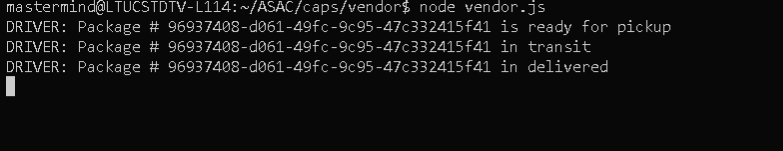

# caps

Event Driven Applications - Package tracking system using TCP, socket.io, node, express

## Author: Rami Zaitoun

**Version**: 1.0.0

##  links and resources 

# HUB

# Driver

# Vendor 

.env requirements
PORT - Port Number

npm install
(to install dependencies: express, dotenv, jest, faker)

Running the app
npm run start
produces console.log ' s of a stream of faker generated orders as they are fired from the event handler (events.emit) after having been declared with events.on

Tests
Unit Tests: npm run test

## Architecture

node.js based server that uses express library and dotenv package
tests performed with jest

## Credits and Collaborations
Estimate of time needed to complete: 2 hours
Start time: 2:30 pm
Finish time: 7:30 pm
Actual time needed to complete: 5 hours
